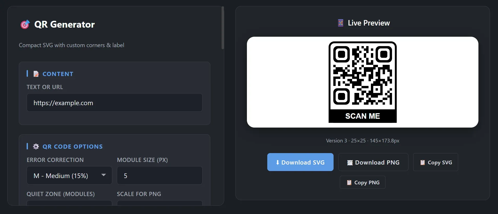

**Live Demo:** https://nezarati.github.io/qr-code-generator/index.html

# QR Code Generator

## 📝 Description
A single-file QR code generator built with vanilla JavaScript and SVG. It allows you to create customized QR codes with unique module shapes, stylized position patterns (including an optional 4th corner), and auto-fitting labels. All QR codes are rendered as scalable vectors.

## ✨ Features
- Customizable colors for data, background, and corners.
- Custom data module shapes (square, rounded, circle, diamond) with adjustable corner radius.
- Customizable position patterns for the three standard corners.
- Optional fourth corner (bottom-right) with styles like concentric rings or diamonds.
- Labels below the QR code with automatic font scaling and custom borders.
- Controls for error correction, module size, quiet zones, and transparency.
- Export to SVG or PNG, with options to copy the code or image to the clipboard.
- Dark-themed, responsive interface.

## 🛠️ Technologies Used
- HTML5 / CSS3 (Vanilla, no frameworks)
- JavaScript (ES6+)
- SVG (Scalable Vector Graphics)
- qrcode-generator (Library for generating the QR matrix)

## 🚀 Getting Started

### Run Locally
1. Clone or download this repository.
2. Open the `index.html` file in any modern web browser.

### Host on GitHub Pages
1. Push the `index.html` file to your GitHub repository.
2. Go to Settings > Pages.
3. Select your branch (e.g., `main`) and click Save.
4. Your live demo will be available at `https://nezarati.github.io/qr-code-generator/index.html`.

## 📄 License
This project is open source and available under the MIT License.
